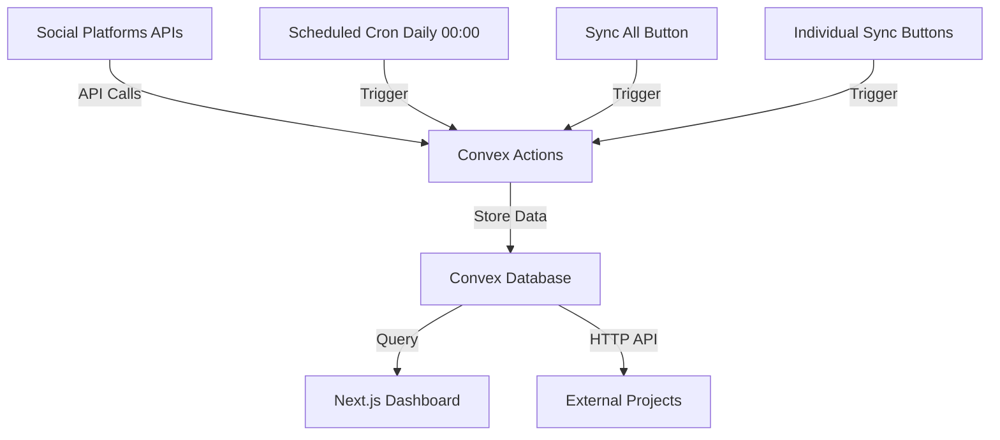

# Social Platform API Integration Plan

## Overview

Integrate 6 social platforms to fetch follower/subscriber metrics, store in Convex database, update via scheduled cron jobs and manual triggers, and expose via HTTP API for external projects like links.ryanfurrer.com.

## Architecture



## Data Requirements Per Platform

### Twitter/X

- **follower_count**: Number of followers
- **profile_url**: Profile URL (e.g., https://twitter.com/username)
- API field mapping: `public_metrics.followers_count` → `follower_count`

### Bluesky

- **follower_count**: Number of followers
- **profile_url**: Profile URL (e.g., https://bsky.app/profile/username.bsky.social)
- API field mapping: `followersCount` → `follower_count`

### LinkedIn

- **follower_count**: Number of followers
- **profile_url**: Profile URL
- API field mapping: Check LinkedIn API v2 response structure

### Twitch

- **follower_count**: Number of followers (free tier)
- **subscriber_count**: Number of subscribers (paid tier)
- **profile_url**: Channel URL (e.g., https://twitch.tv/username)
- API field mapping: `followers` → `follower_count`, `subscribers` → `subscriber_count`

### YouTube

- **follower_count**: Number of subscribers (free tier - mapped to follower_count for consistency)
- **profile_url**: Channel URL
- API field mapping: `statistics.subscriberCount` → `follower_count` (note: YouTube calls them "subscribers" but we store as followers to maintain free/paid distinction)

### GitHub

- **follower_count**: Number of followers
- **profile_url**: Profile URL (e.g., https://github.com/username)
- API field mapping: `followers` → `follower_count`

## Implementation Steps

### 1. Update Database Schema

**File:** `convex/schema.ts`

**IMPORTANT**: Make all new fields optional to avoid errors with existing data.

Update schema:

```typescript
socials: defineTable({
  follower_count: v.float64(), // existing - free tier metric (all platforms)
  platform: v.string(), // existing
  url: v.string(), // existing
  // New optional fields:
  subscriber_count: v.optional(v.float64()), // Paid tier metric (Twitch only)
  profile_url: v.optional(v.string()), // Explicit profile URL
  last_updated: v.optional(v.number()), // Unix timestamp
});
```

**Data Model Semantics:**

- `follower_count` = Free tier metric (Twitter, Bluesky, LinkedIn, GitHub, YouTube, Twitch)
- `subscriber_count` = Paid/premium tier metric (Twitch only)
- YouTube's "subscribers" are stored as `follower_count` to maintain semantic consistency

### 2. Create API Integration Actions

**File:** `convex/socials.ts` (expand existing file)

Create Convex actions (not queries) to fetch from external APIs. Each action should:

- Accept platform identifier or username/handle
- Fetch the required metrics from respective API
- Return structured data matching our schema
- Handle API errors gracefully

Actions to create:

- `fetchTwitterMetrics` - Twitter/X API v2
- `fetchBlueskyMetrics` - Bluesky ATProto API
- `fetchLinkedInMetrics` - LinkedIn API
- `fetchTwitchMetrics` - Twitch Helix API
- `fetchYouTubeMetrics` - YouTube Data API v3
- `fetchGitHubMetrics` - GitHub REST API

### 3. Create Database Mutations

**File:** `convex/socials.ts`

- `updateSocialMetrics` - Upsert social platform data (update or insert)
- `syncPlatform` - Sync a single platform (action that calls fetch + update)
- `syncAllPlatforms` - Orchestrate fetching from all platforms and updating DB

### 4. Set Up Scheduled Updates

**File:** `convex/cron.ts` (new file)

- Create cron job to run `syncAllPlatforms` daily at 00:00 (midnight)
- Use Convex `cronJobs` API
- Cron expression: `"0 0 * * *"` (daily at midnight UTC)

### 5. Create HTTP API Endpoints

**File:** `convex/http.ts` (new file)

- `GET /api/socials` - Public endpoint returning all social metrics as JSON
- `GET /api/socials/:platform` - Get specific platform metrics
- `POST /api/socials/sync` - Manual trigger endpoint (optional auth for security)

### 6. Update Socials Component

**File:** `components/socials.tsx`

- Display `last_updated` timestamp for each platform
- Add "Sync All" button that triggers `syncAllPlatforms` action
- Add individual sync button for each platform card
- Show loading states during sync operations
- Display both `follower_count` and `subscriber_count` when available

### 7. Environment Variables

**File:** `.env.local` (user will add)

Required API keys/credentials for free tiers:

#### Twitter/X

- `TWITTER_BEARER_TOKEN` - OAuth 2.0 Bearer token from Twitter Developer Portal

#### Bluesky

- `BLUESKY_HANDLE` - Your Bluesky handle (e.g., username.bsky.social)
- `BLUESKY_APP_PASSWORD` - App password from Bluesky settings

#### LinkedIn

- `LINKEDIN_ACCESS_TOKEN` - OAuth 2.0 access token
- `LINKEDIN_PERSON_ID` - Your LinkedIn person ID (URN format)

#### Twitch

- `TWITCH_CLIENT_ID` - Client ID from Twitch Developer Console
- `TWITCH_CLIENT_SECRET` - Client secret
- `TWITCH_USERNAME` - Your Twitch username

#### YouTube

- `YOUTUBE_API_KEY` - API key from Google Cloud Console
- `YOUTUBE_CHANNEL_ID` - Your YouTube channel ID

#### GitHub

- `GITHUB_USERNAME` - Your GitHub username (public API, no auth required)
- `GITHUB_TOKEN` - Optional, for higher rate limits (personal access token)

## Platform-Specific Implementation Notes

### Twitter/X

- **API**: Twitter API v2
- **Endpoint**: `GET /2/users/by/username/{username}?user.fields=public_metrics,username`
- **Auth**: OAuth 2.0 Bearer token
- **Cost**: API calls cost $0.010 per call (not free tier)
- **Rate Limits**: Varies by tier (Essential: 10,000 tweets/month)

### Bluesky

- **API**: ATProto (Bluesky's protocol)
- **Endpoint**: `GET https://public.api.bsky.app/xrpc/app.bsky.actor.getProfile?actor={handle}`
- **Auth**: No auth required for profile lookup (public API). Handle must be formatted as `username.bsky.social` or DID
- **Free Tier**: Public API
- **Rate Limits**: ~3000 requests/hour

### LinkedIn

- **API**: LinkedIn API v2
- **Endpoint**: `GET /v2/me?projection=(id,vanityName)` (not `/v2/people` as originally planned)
- **Auth**: OAuth 2.0 access token
- **Free Tier**: Limited requests
- **Rate Limits**: Varies by endpoint
- **Note**: ✅ Implemented. Follower count not available for personal profiles via API - returns 0 as placeholder. Profile URL successfully extracted from `vanityName` or numeric ID from `id` field (handles `urn:li:person:{id}` format).

### Twitch

- **API**: Twitch Helix API
- **Endpoint**: `GET /helix/channels/followers?broadcaster_id={broadcaster_id}` for followers, `GET /helix/subscriptions?broadcaster_id={user_id}` for subscribers (paginated, 100 per page)
- **Auth**: OAuth 2.0 Client Credentials flow (App Access Token) for follower count. User Access Token (Authorization Code flow) for subscriber count.
- **Free Tier**: Public API
- **Rate Limits**: 800 requests/minute
- **Note**: ✅ Full OAuth implementation. Follower count uses App Access Token. Subscriber count requires User Access Token with `channel:read:subscriptions` scope - implemented with OAuth flow, token storage, refresh mechanism, and pagination. User must visit `/api/twitch/auth` to authorize.

### YouTube

- **API**: YouTube Data API v3
- **Endpoint**: `GET /youtube/v3/channels?part=statistics&id={channel_id}`
- **Auth**: API key (no OAuth needed for public data)
- **Free Tier**: 10,000 units/day quota
- **Rate Limits**: Quota-based (1 unit per read request)

### GitHub

- **API**: GitHub REST API
- **Endpoint**: `GET /users/{username}`
- **Auth**: Optional (personal access token for rate limits)
- **Free Tier**: Public API, 60 requests/hour unauthenticated, 5,000/hour authenticated
- **Rate Limits**: 60/hour (no auth), 5,000/hour (with token)

## Files to Create/Modify

1. `convex/schema.ts` - Update schema with optional fields
2. `convex/socials.ts` - Add actions and mutations
3. `convex/cron.ts` - New file for scheduled jobs
4. `convex/http.ts` - New file for HTTP API
5. `components/socials.tsx` - Add sync buttons and last updated display

## Dependencies

No new npm packages required - Convex actions can use native `fetch` API.

## Platform Handles

All credentials are available in `.env.local`. Platform handles:

- **Twitter/X**: `ryandotfurrer`
- **Bluesky**: `ryandotfurrer`
- **LinkedIn**: `ryanfurrer` (Person ID: `urn:li:person:ryanfurrer`)
- **Twitch**: `ryandotfurrer`
- **YouTube**: `ryandotfurrer` (Channel ID: `UC55hUb2xxOcdig6fih490-g`)
- **GitHub**: `ryandotfurrer`

**Note**: GitHub contribution graph feature is deferred for now.

## Testing Strategy

1. Test each platform action individually with your credentials
2. Verify database updates with correct field mappings
3. Test HTTP endpoints return correct JSON structure
4. Verify cron job executes at 00:00 daily
5. Test manual sync buttons (all + individual)
6. Verify last_updated timestamps update correctly

## Implementation Progress

### Step 1: Update Database Schema ✅ COMPLETED

- ✅ Added optional `subscriber_count` field (v.optional(v.float64())) for Twitch paid tier
- ✅ Added optional `profile_url` field (v.optional(v.string())) for explicit profile URLs
- ✅ Added optional `last_updated` field (v.optional(v.number())) for Unix timestamp tracking
- ✅ Added `twitchOAuth` table for storing Twitch User Access Tokens (OAuth flow)
- ✅ Added `twitchOAuthState` table for CSRF protection during OAuth flow
- All fields are optional to prevent errors with existing data
- Schema maintains backward compatibility with existing `follower_count`, `platform`, and `url` fields

**Findings:**

- Convex schema uses `v.optional()` wrapper for optional fields
- Existing required fields (`follower_count`, `platform`, `url`) remain unchanged
- Schema update is backward compatible - existing records will work without new fields
- `twitchOAuth` table stores: `access_token`, `refresh_token`, `expires_at`, `scope`, `token_type`
- `twitchOAuthState` table stores: `state` (CSRF token), `expires_at` (10-minute expiration)

### Step 2: Create API Integration Actions ✅ COMPLETED

- ✅ `fetchTwitterMetrics` - Twitter/X API v2
- ✅ `fetchBlueskyMetrics` - Bluesky ATProto API
- ✅ `fetchLinkedInMetrics` - LinkedIn API v2 (follower_count returns 0, profile_url works)
- ✅ `fetchTwitchMetrics` - Twitch Helix API (with OAuth token management)
- ✅ `fetchYouTubeMetrics` - YouTube Data API v3
- ✅ `fetchGitHubMetrics` - GitHub REST API

**Findings:**

- **Twitter**: `/2/users/me` requires user context auth; use `/2/users/by/username/{username}` with bearer token for public data. API calls cost $0.010 per call.
- **Bluesky**: Public profile endpoint requires no auth. Handle auto-formatted: if handle doesn't include "." or start with "did:", append `.bsky.social`. Response field is `followersCount`. Profile URL constructed as `https://bsky.app/profile/{formattedHandle}`.
- **LinkedIn**: ✅ Implemented but limited. Follower count not available via API for personal profiles - returns 0 as placeholder. Uses `/v2/me?projection=(id,vanityName)` endpoint (not `/v2/people`). Extracts numeric ID from `urn:li:person:{id}` format. Profile URL uses `vanityName` if available, otherwise numeric ID: `https://www.linkedin.com/in/{profileSlug}`.
- **Twitch**: Complex OAuth implementation. Follower count uses App Access Token (Client Credentials flow) via `/helix/channels/followers` endpoint (provides `total` count directly). Subscriber count requires User Access Token with `channel:read:subscriptions` scope - implemented with full OAuth flow, token storage, refresh mechanism, and pagination (100 per page). OAuth state management added for CSRF protection.
- **YouTube**: Uses `/youtube/v3/channels?part=statistics,snippet` endpoint. Maps `subscriberCount` to `follower_count` for consistency. Profile URL logic: uses `snippet.customUrl` if available (`https://youtube.com/{customUrl}`), otherwise falls back to `https://youtube.com/channel/{channelId}`.
- **GitHub**: Uses `/users/{username}` endpoint. Optional token for higher rate limits (5,000/hour vs 60/hour). Returns `followers` field as `follower_count`. Profile URL uses `html_url` from API response, falls back to constructed URL.

### Step 3: Create Database Mutations ✅ COMPLETED

- ✅ `updateSocialMetrics` mutation - Upserts social platform data with optional fields
- ✅ `syncPlatform` action - Syncs a single platform (fetch + update)
- ✅ `syncAllPlatforms` action - Orchestrates all platform syncs with error handling

**Findings:**

- Mutation uses upsert pattern (find by platform, update or insert)
- Actions use `api` from `./_generated/api` to reference other actions/mutations
- `syncAllPlatforms` uses `Promise.allSettled` to handle partial failures gracefully
- Platform names normalized with `normalizePlatformName()` function for proper capitalization and alias handling
- Case-insensitive lookup ensures existing records are found regardless of casing
- `last_updated` timestamp set to `Date.now()` on every update/insert
- `url` field falls back to `profile_url` if not provided during insert
- `deleteSocial` mutation added for record deletion
- `cleanupDuplicateSocials` action added to remove existing duplicate records

### Step 4: Set Up Scheduled Updates ✅ COMPLETED

- ✅ Create `convex/cron.ts` file
- ✅ Configure daily cron job at 00:00 UTC using `cronJobs().daily()`

**Findings:**

- Convex uses `cronJobs()` API with `daily()` method for scheduled jobs
- Cron job configured to run `syncAllPlatforms` at midnight UTC daily

### Step 5: Create HTTP API Endpoints ✅ COMPLETED

- ✅ Create `convex/http.ts` file
- ✅ GET `/api/twitch/auth` - Twitch OAuth initiation endpoint
- ✅ GET `/api/twitch/callback` - Twitch OAuth callback handler
- ✅ GET `/api/socials` endpoint - Returns all social metrics as JSON
- ✅ GET `/api/socials/:platform` endpoint - Returns specific platform metrics
- ✅ POST `/api/socials/sync` endpoint - Manual sync trigger
- ✅ CORS headers added to all social metrics endpoints

**Findings:**

- HTTP router implemented using `httpRouter()` from `convex/server`
- Twitch OAuth flow fully implemented:
  - State generation for CSRF protection (random 30-char string)
  - State stored in database with 10-minute expiration
  - State validation on callback (checks expiration, one-time use)
  - Token exchange and storage in `twitchOAuth` table
  - Redirect to success page after auth
  - Redirect URI: `https://aware-chihuahua-335.convex.site/api/twitch/callback`
- Social metrics endpoints fully implemented:
  - GET `/api/socials` - Returns all platforms from `listSocials` query
  - GET `/api/socials/:platform` - Uses `pathPrefix: "/api/socials/"` for dynamic routing, extracts platform from URL path
  - POST `/api/socials/sync` - Triggers `syncAllPlatforms` action, returns success/error JSON
  - All endpoints include CORS headers (`Access-Control-Allow-Origin: *`, methods, headers)
  - OPTIONS handlers added for CORS preflight requests
  - Route ordering: exact paths (`/api/socials`, `/api/socials/sync`) registered before prefix route to avoid conflicts

### Step 6: Update Socials Component ✅ COMPLETED

- ✅ Display `last_updated` timestamp - Formatted as relative time (e.g., "2h ago", "3d ago") or "Never" if not set
- ✅ Add "Sync All" button - Triggers `syncAllPlatforms` action, shows loading spinner during sync
- ✅ Add individual sync buttons - Each platform card has a sync button in the top-right corner
- ✅ Add loading states - Uses `Loader2` spinner icon during sync operations, disables buttons appropriately
- ✅ Display `subscriber_count` when available - Shows subscriber count below follower count for Twitch

**Findings:**

- Used `useAction` hook from `convex/react` to call `syncAllPlatforms` and `syncPlatform` actions
- Loading states managed with `useState` for both global sync and individual platform syncs
- Timestamp formatting function converts Unix timestamp to human-readable relative time
- Individual sync buttons use ghost variant with icon-only design to save space
- Sync All button placed in header with outline variant and refresh icon
- Subscriber count only displayed when `subscriber_count` is defined and > 0
- Profile URL uses `profile_url` field if available, falls back to `url` field
- Buttons disabled during sync operations to prevent duplicate requests

## Troubleshooting & Fixes

### Twitch OAuth Implementation

**Problem**: Subscriber count requires User Access Token with `channel:read:subscriptions` scope, not available via App Access Token (Client Credentials flow).

**Solution**: Implemented full OAuth 2.0 authorization code flow:
- Created `twitchOAuth` and `twitchOAuthState` tables in schema
- Added HTTP endpoints: `/api/twitch/auth` (initiate) and `/api/twitch/callback` (handle)
- Implemented CSRF protection with state parameter (stored in DB, 10-min expiration)
- Token storage with refresh mechanism (`refreshTwitchToken` action)
- Auto-refresh logic in `getValidTwitchUserToken` (refreshes if < 5 minutes until expiration)
- Subscriber count fetched with pagination (100 per page) using User Access Token

**Token Management**:
- `storeTwitchTokens` mutation - upserts token records
- `getTwitchUserToken` query - retrieves current token
- `refreshTwitchToken` action - refreshes expired tokens using refresh_token
- `getValidTwitchUserToken` action - returns valid token, auto-refreshes if needed

### LinkedIn API Limitations

**Problem**: Follower count not available via API for personal profiles.

**Solution**: 
- Implemented `/v2/me` endpoint (not `/v2/people` as originally planned)
- Returns `follower_count: 0` as placeholder
- Successfully extracts profile URL using `vanityName` or numeric ID from `id` field
- Handles `urn:li:person:{id}` format correctly

### Bluesky Handle Formatting

**Problem**: Handle format inconsistent - sometimes includes `.bsky.social`, sometimes doesn't.

**Solution**: Auto-formatting logic in `fetchBlueskyMetrics`:
- If handle includes "." or starts with "did:", use as-is
- Otherwise, append `.bsky.social`
- Ensures consistent API calls and profile URL construction

### YouTube Profile URL

**Problem**: Need to support both custom URLs and channel ID formats.

**Solution**: 
- Check for `snippet.customUrl` first
- If available, use `https://youtube.com/{customUrl}`
- Otherwise, fall back to `https://youtube.com/channel/{channelId}`
- Added `snippet` to API request `part` parameter

### Twitch Subscriber Count Pagination

**Problem**: Twitch subscriptions API returns paginated results (max 100 per page).

**Solution**: Implemented pagination loop in `fetchTwitchMetrics`:
- Uses `cursor` from `pagination.cursor` for next page
- Accumulates `totalSubscribers` across all pages
- Handles API errors gracefully (continues with 0 if unauthorized)

### Duplicate Platform Records

**Problem**: Syncing platforms created duplicate cards instead of updating existing ones. Issues:
- Platform names with different casing (e.g., "Twitter" vs "twitter", "YouTube" vs "youtube") were treated as different platforms
- Platform aliases (e.g., "X/Twitter", "X") weren't normalized to "Twitter"
- Existing records had inconsistent capitalization

**Solution**: Implemented platform name normalization and cleanup:
- Created `normalizePlatformName()` function that:
  - Handles Twitter/X aliases: "x", "x/twitter", anything containing "twitter" → "Twitter"
  - Maps to proper capitalization: bluesky → Bluesky, github → GitHub, twitch → Twitch, youtube → YouTube, linkedin → LinkedIn
- Updated `updateSocialMetrics` mutation to:
  - Use `normalizePlatformName()` for both lookup (case-insensitive) and storage
  - Ensures all platform names are stored with proper capitalization
- Added `deleteSocial` mutation for record deletion
- Added `cleanupDuplicateSocials` action that:
  - Groups records by normalized platform name
  - Keeps the record with most recent `last_updated` (or highest `_id` if no timestamp)
  - Updates kept records to use normalized platform names
  - Deletes all duplicate records
  - Returns summary: `{ deleted, kept, total }`

**Result**: Future syncs update existing records correctly. Run `cleanupDuplicateSocials` once to remove existing duplicates.

## Notes for Future Reference

- All new schema fields are optional to prevent errors with existing data
- **Data Model**: `follower_count` = free tier (all platforms), `subscriber_count` = paid tier (Twitch only)
- YouTube's API returns "subscribers" but we map to `follower_count` for semantic consistency
- Free API tiers have rate limits - consider implementing retry logic
- Twitch User Access Token requires manual OAuth flow - user must visit `/api/twitch/auth` to authorize
- Twitch token refresh happens automatically when < 5 minutes until expiration
- LinkedIn follower count unavailable - returns 0 (API limitation for personal profiles)
- HTTP API should be CORS-enabled for external project access (when social metrics endpoints are implemented)
- LinkedIn uses `/v2/me` endpoint, extracts ID from `urn:li:person:{id}` format automatically
- Platform names are normalized to proper capitalization (Twitter, GitHub, Twitch, YouTube, Bluesky, LinkedIn)
- Platform aliases are handled (X/Twitter, X → Twitter)
- `cleanupDuplicateSocials` action available to remove existing duplicate records
